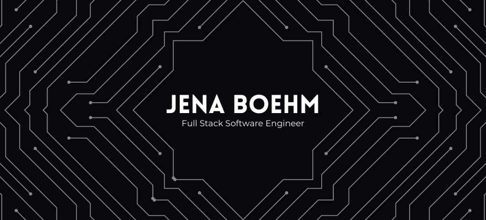

I am a multifaceted, intuitive, and detail-driven Full Stack Software Engineer whose work is inspired by creative collaboration, authentic expression, and effective organization.

My past experience as an event professional and in the music industry has provided me with a multifaceted skill set to tackle any problem or project I encounter. It has trained me to be detail-oriented, precise, and intentional, while at the same time considering how my work may affect the customers, the rest of my team, and the project as a whole. 

Tech is the future, and I believe that as a software engineer I’d be able to directly and positively impact the lives of many people.

---

### Tech Stack
- Languages: HTML, CSS, JavaScript
- Front-End: React, Redux
- Back-End: NodeJs, Express
- Testing: Jest, QUnit
- Databases: PostgreSQL
- Tools: VSCode, Git, GitHub, Heroku, Netlify, Postman, PGAdmin, Twilio, AWS Rekognition, Slack, Asana, Airtable, Ableton Live

---

### Contact
- jenaluxboehm@gmail.com
- [LinkedIn](https://www.linkedin.com/in/jenaboehm/)
